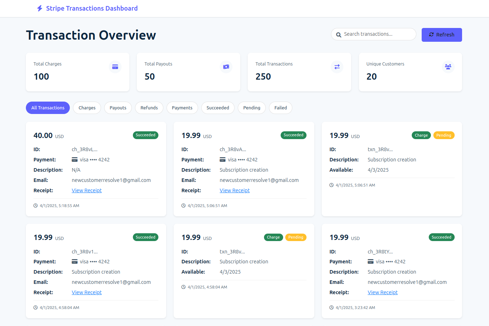

# Stripe Transactions Dashboard

A clean, modern dashboard for viewing and analyzing Stripe transactions without needing access to the Stripe dashboard.



## Features

- **All-in-one dashboard** - View charges, payouts, refunds, and all transaction types in a single interface
- **Customer email tracking** - See customer emails associated with each transaction
- **Powerful filtering** - Filter by transaction type, status, and search for specific transactions
- **Summary statistics** - Quick overview of your transaction counts and customer metrics
- **Professional UI** - Clean, Stripe-inspired design with a modern card-based layout
- **Export functionality** - Export filtered transactions to CSV for further analysis
- **Auto-refresh** - Keep your data current with configurable auto-refresh

## Installation

### Prerequisites

- Node.js (v12 or higher)
- npm
- A Stripe account with API access

### Setup

1. Clone the repository or download the files

```bash
git clone https://github.com/yourusername/stripe-transactions-dashboard.git
cd stripe-transactions-dashboard
```

2. Install dependencies

```bash
npm install
```

3. Create a `.env` file in the root directory and add your Stripe API key

```
STRIPE_SECRET_KEY=sk_test_yourApiKeyHere
```

4. Start the server

```bash
node server.js
```

5. Open your browser and navigate to http://localhost:3000

## Usage

### Viewing Transactions

- All transactions appear on the main dashboard, sorted by date (newest first)
- Click on the filter buttons to view specific transaction types:
  - **All Transactions** - Shows everything
  - **Charges** - Shows only customer payments
  - **Payouts** - Shows transfers to your bank account
  - **Refunds** - Shows refunded transactions
  - **Payments** - Shows payment transactions
  - **Succeeded/Pending/Failed/Canceled** - Filter by transaction status
  - **Disputes** - View disputed transactions

### Searching Transactions

- Use the search box to find specific transactions
- Search works across transaction IDs, descriptions, amounts, and customer emails
- Search and filters can be combined (e.g., search for a specific email within failed transactions)

### Exporting Data

- Click the "Export CSV" button to download your current filtered view as a CSV file
- The CSV includes all transaction details including IDs, amounts, statuses, and customer emails

### Auto-Refresh

- Toggle the "Auto-refresh" switch to enable or disable automatic data refreshing
- When enabled, data will refresh every 5 minutes automatically
- Your current filters and search criteria are preserved during refresh

## Customization

### Changing the refresh interval

To modify the auto-refresh interval, locate this line in `index.html`:

```javascript
setupAutoRefresh(5); // 5 minutes
```

Change the number to your desired refresh interval in minutes.

### Adjusting transactions per page

To show more or fewer transactions per page, find this line:

```javascript
const itemsPerPage = 12;
```

Change the value to your preferred number of items.

## Troubleshooting

### "Stripe not initialized" error

- Verify that your Stripe API key is correct in the `.env` file
- Make sure your Stripe account has API access enabled
- Check that your API key has the necessary permissions

### No transactions showing

- Confirm that your Stripe account has transactions
- If using a test key, make sure you have test transactions
- Try using a live key if available (make sure it's secure)

## Technology Stack

- **Frontend**: HTML, CSS, JavaScript
- **Backend**: Node.js, Express
- **Data**: Stripe API
- **Styling**: Bootstrap 5, Font Awesome

## Security Notes

- This application stores your Stripe API key on the server side only
- No sensitive information is exposed to the client
- For production use, consider additional security measures:
  - Implement proper authentication
  - Use HTTPS
  - Add rate limiting
  - Consider IP restrictions
